# ARIA Token (ARI)

<p align="center">
  
</p>

ARIA Token is a Solana-based cryptocurrency for the ARIA decentralized AI personal assistant ecosystem.

## Project Overview

ARIA is a decentralized AI personal assistant that leverages the open data ecosystem of Android phones to deeply analyze users' daily behaviors and needs, providing highly personalized life management, financial planning, and social interaction support. By utilizing Solana blockchain's efficiency and low cost, ARIA decentralizes the storage of users' private data and incentivizes ecosystem participation through a token economy.

## Current Project Status

**Version**: v0.1.0 (Initial Release)  
**Development Stage**: Early Development  
**Next Milestone**: Phase 1 Completion - Basic Assistant and Data Framework  

ARIA Token is currently in its foundational development phase. The core token contract has been implemented on Solana, with comprehensive functionality for token management, distribution, and security. The Android application framework is under active development, with data collection and core AI capabilities as the primary focus.

## Project Timeline & Progress

### Overall Timeline (2023-2025)

```
2023 Q4           2024 Q1           2024 Q2           2024 Q3           2024 Q4           2025 Q1
|----------------|----------------|----------------|----------------|----------------|----------------|
[   Phase 1:    ][      Phase 2:                  ][      Phase 3:                  ][Phase 4: ...
  Basic Assistant  Information Management           Complex Integration
  & Data Framework & Social Features                Capabilities
]                [                                ][                                ][
```

### Detailed Project Progress

| Component               | Status        | Progress | Target Completion |
|-------------------------|---------------|----------|-------------------|
| Token Contract          | Completed     | 100%     | 2023 Q4           |
| Security Framework      | Completed     | 100%     | 2023 Q4           |
| Token Economy Features  | Completed     | 100%     | 2023 Q4           |
| Android Data Collection | In Progress   | 45%      | 2024 Q1           |
| AI Core Implementation  | In Progress   | 30%      | 2024 Q1           |
| UI/UX Development       | Planning      | 15%      | 2024 Q2           |
| Blockchain Integration  | In Progress   | 60%      | 2024 Q1           |
| Third-party APIs        | Planning      | 10%      | 2024 Q2           |
| Testnet Deployment      | Not Started   | 0%       | 2024 Q1           |
| Mainnet Launch          | Not Started   | 0%       | 2024 Q2           |

### Project Swimlane Diagram

```
┌──────────────┬──────────────────┬──────────────────┬──────────────────┬──────────────────┐
│              │     December 2023    │     Q1 2024      │     Q2 2024      │     Q3 2024      │
├──────────────┼──────────────────┼──────────────────┼──────────────────┼──────────────────┤
│ Blockchain   │ ██████████████   │ ████████████     │ ██████████       │ ████████         │
│ Development  │ Token Contract   │ Testnet Deploy   │ Mainnet Launch   │ Token Utility    │
│              │ Implementation   │ & Testing        │ & Distribution   │ Expansion        │
├──────────────┼──────────────────┼──────────────────┼──────────────────┼──────────────────┤
│ Mobile App   │ ████████         │ ██████████████   │ ██████████████   │ ██████████████   │
│ Development  │ Architecture     │ Core Framework   │ UI Development   │ Feature          │
│              │ Design           │ Implementation   │ & Testing        │ Expansion        │
├──────────────┼──────────────────┼──────────────────┼──────────────────┼──────────────────┤
│ AI           │ ██████           │ ████████████     │ ██████████████   │ ██████████████   │
│ Development  │ Initial Models   │ Data Collection  │ Model Training   │ Advanced         │
│              │ Research         │ & Processing     │ & Deployment     │ Analytics        │
├──────────────┼──────────────────┼──────────────────┼──────────────────┼──────────────────┤
│ Business     │ ████████         │ ██████████       │ ██████████████   │ ██████████████   │
│ Development  │ Tokenomics       │ Partnership      │ Marketing        │ Community        │
│              │ Design           │ Development      │ Launch           │ Expansion        │
├──────────────┼──────────────────┼──────────────────┼──────────────────┼──────────────────┤
│ User         │                  │ ████             │ ████████         │ ██████████████   │
│ Adoption     │                  │ Alpha Testing    │ Beta Release     │ Public Release   │
│              │                  │                  │                  │ & Growth         │
└──────────────┴──────────────────┴──────────────────┴──────────────────┴──────────────────┘
```

## Technical Architecture

### System Components Overview

```
ARIA Ecosystem
├── Blockchain Layer (Solana)
│   ├── ARIA Token Contract
│   ├── Data Verification System
│   └── Reward Distribution Mechanism
├── Mobile Application Layer
│   ├── Android Data Collection Framework
│   ├── AI Analysis Engine
│   └── User Interface
└── Backend Services
    ├── Data Processing Pipeline
    ├── AI Model Training System
    └── API Gateway
```

### Detailed Technical Architecture

```
┌─────────────────────────────────────────────────────────────┐
│                      User Devices                           │
│  ┌──────────────┐  ┌──────────────┐  ┌──────────────────┐  │
│  │  Android App │  │  Web Portal  │  │  Partner Services │  │
│  └───────┬──────┘  └───────┬──────┘  └─────────┬────────┘  │
└──────────┼───────────────┬─┼────────────────────┼──────────┘
           │               │ │                    │
           ▼               │ │                    ▼
┌──────────────────┐      │ │      ┌───────────────────────┐
│   Data Collection│◄─────┘ └─────►│   Third-party API     │
│   Framework      │               │   Integrations        │
└────────┬─────────┘               └───────────┬───────────┘
         │                                     │
         ▼                                     ▼
┌─────────────────────────────────────────────────────────────┐
│                  Backend Services                           │
│  ┌──────────────────────────┐  ┌───────────────────────┐   │
│  │  Data Processing Pipeline │  │  AI Model Training    │   │
│  │  ┌────────────────┐      │  │  ┌─────────────────┐  │   │
│  │  │ Data Validation│      │  │  │ Model Training  │  │   │
│  │  └────────┬───────┘      │  │  └────────┬────────┘  │   │
│  │           │              │  │           │           │   │
│  │  ┌────────▼───────┐      │  │  ┌────────▼────────┐  │   │
│  │  │ Data Enrichment│      │  │  │ Model Evaluation│  │   │
│  │  └────────┬───────┘      │  │  └────────┬────────┘  │   │
│  │           │              │  │           │           │   │
│  │  ┌────────▼───────┐      │  │  ┌────────▼────────┐  │   │
│  │  │ Data Storage   │      │  │  │ Model Deployment│  │   │
│  │  └────────────────┘      │  │  └─────────────────┘  │   │
│  └──────────────────────────┘  └───────────────────────┘   │
│                                                             │
│  ┌──────────────────────────┐  ┌───────────────────────┐   │
│  │  API Gateway             │  │  User Authentication  │   │
│  └──────────────────────────┘  └───────────────────────┘   │
└───────────────────────────┬─────────────────────────────────┘
                            │
                            ▼
┌─────────────────────────────────────────────────────────────┐
│                  Blockchain Layer (Solana)                  │
│                                                             │
│  ┌──────────────────────────────────────────────────────┐  │
│  │                  ARIA Token Contract                  │  │
│  │                                                       │  │
│  │  ┌────────────┐  ┌────────────┐  ┌────────────────┐  │  │
│  │  │ Token Core │  │ Security   │  │ Token Economy  │  │  │
│  │  │ Functions  │  │ System     │  │ Features       │  │  │
│  │  └────────────┘  └────────────┘  └────────────────┘  │  │
│  │                                                       │  │
│  │  ┌────────────┐  ┌────────────┐  ┌────────────────┐  │  │
│  │  │ Metadata   │  │ Events     │  │ Upgrade        │  │  │
│  │  │ Management │  │ System     │  │ Mechanism      │  │  │
│  │  └────────────┘  └────────────┘  └────────────────┘  │  │
│  └──────────────────────────────────────────────────────┘  │
│                                                             │
│  ┌─────────────────────┐    ┌───────────────────────────┐  │
│  │ Data Verification   │    │ Reward Distribution       │  │
│  │ System              │    │ Mechanism                 │  │
│  └─────────────────────┘    └───────────────────────────┘  │
└─────────────────────────────────────────────────────────────┘
```

### Token Smart Contract Architecture

```
aria-token/
├── src/                  # Rust source code
│   ├── lib.rs            # Main contract implementation
│   │   ├── Constants     # Token decimals, supply, distribution
│   │   ├── Entrypoint    # Program entry point
│   │   └── Instructions  # Main instruction processor
│   │
│   ├── error.rs          # Error handling
│   │   ├── Error Types   # Custom error definitions
│   │   └── Result Types  # Result wrapper types
│   │
│   ├── instruction.rs    # Instruction definitions
│   │   ├── Initialize    # Token initialization instructions
│   │   ├── Distribution  # Token distribution instructions
│   │   └── Management    # Token management instructions
│   │
│   ├── metadata.rs       # Token metadata implementation
│   │   ├── Metadata      # Name, symbol, URI storage
│   │   └── Updates       # Metadata update mechanisms
│   │
│   ├── token_economy.rs  # Token economic features
│   │   ├── Burn          # Token burning mechanisms
│   │   ├── Lock          # Token locking/vesting
│   │   └── Custom Lock   # Customizable lock durations
│   │
│   ├── security.rs       # Authority and permissions
│   │   ├── Roles         # Role-based access control
│   │   ├── Authorities   # Authority management
│   │   └── Verification  # Transaction verification
│   │
│   ├── events.rs         # Event logging system
│   │   ├── Event Types   # Different event definitions
│   │   └── Logging       # Event logging functions
│   │
│   ├── upgradable.rs     # Contract upgrade mechanism
│   │   ├── Versioning    # Version control system
│   │   ├── Scheduling    # Upgrade scheduling with delay
│   │   └── Finalization  # Upgrade finalization and cancellation
│   │
│   ├── pump_fun.rs       # pump.fun integration
│   │   ├── Config        # Platform-specific configuration
│   │   ├── Pricing       # Token pricing mechanisms
│   │   └── Limits        # Transaction limits and controls
│   │
│   └── test.rs           # Tests
│       ├── Unit Tests    # Individual function tests
│       └── Integration   # End-to-end contract tests
│
├── scripts/              # Deployment scripts
│   └── deploy.js         # Deployment automation
│
└── keys/                 # Directory for keypairs
    └── .gitkeep          # Placeholder for key storage
```

### Data Flow Architecture

```
┌──────────────┐     ┌────────────────┐     ┌────────────────┐
│ User Actions │────►│ Mobile App     │────►│ Backend API    │
└──────────────┘     └────────────────┘     └───────┬────────┘
                                                    │
                     ┌────────────────┐             │
                     │ Third-party    │◄────────────┘
                     │ Services       │             │
                     └────────────────┘             ▼
                                             ┌────────────────┐
                                             │ Data Processing│
                                             └───────┬────────┘
                                                     │
┌──────────────┐     ┌────────────────┐             │
│ Token Rewards│◄────│ Blockchain     │◄────────────┘
└──────────────┘     │ Transactions   │
                     └────────────────┘
```

## Code Examples

### Token Initialization

```rust
// From src/lib.rs
const TOKEN_DECIMALS: u8 = 9;
const TOTAL_SUPPLY: u64 = 100_000_000_000_000_000; // 100 million tokens with 9 decimals

// 50% for user incentives
const USER_INCENTIVES: u64 = TOTAL_SUPPLY / 2;
// 20% for team development
const TEAM_DEVELOPMENT: u64 = TOTAL_SUPPLY / 5;
// 20% for community governance
const COMMUNITY_GOVERNANCE: u64 = TOTAL_SUPPLY / 5;
// 10% for marketing and partnerships
const MARKETING_PARTNERSHIPS: u64 = TOTAL_SUPPLY / 10;

pub fn process_instruction(
    program_id: &Pubkey,
    accounts: &[AccountInfo],
    instruction_data: &[u8],
) -> ProgramResult {
    let instruction = AriaTokenInstruction::try_from_slice(instruction_data)?;
    
    match instruction {
        AriaTokenInstruction::InitializeToken => {
            msg!("Instruction: Initialize Token");
            initialize_token(program_id, accounts)
        },
        AriaTokenInstruction::DistributeTokens => {
            msg!("Instruction: Distribute Tokens");
            distribute_tokens(program_id, accounts)
        },
        // Other instructions...
    }
}
```

### Role-Based Security Implementation

```rust
// From src/security.rs
#[derive(BorshSerialize, BorshDeserialize, Debug, PartialEq)]
pub enum Role {
    /// Admin with full control
    Admin,
    /// Minter can mint new tokens
    Minter,
    /// Freezer can freeze accounts
    Freezer,
    /// Burner can burn tokens
    Burner,
}

impl AuthorityList {
    pub fn has_role(&self, key: &Pubkey, role: Role) -> bool {
        // Primary admin always has all roles
        if key == &self.primary_admin {
            return true;
        }
        
        // Check if key has the specific role
        self.authorities.iter().any(|auth| 
            &auth.key == key && auth.role == role && auth.is_active
        )
    }
}
```

### Token Locking Mechanism

```rust
// From src/token_economy.rs
#[derive(BorshSerialize, BorshDeserialize, Debug)]
pub struct TokenLock {
    /// Owner of the locked tokens
    pub owner: Pubkey,
    /// Amount of tokens locked
    pub amount: u64,
    /// Unix timestamp when tokens can be unlocked
    pub unlock_time: u64,
    /// Whether tokens have been claimed after unlock
    pub is_claimed: bool,
}

pub fn lock_tokens(
    program_id: &Pubkey,
    accounts: &[AccountInfo],
    amount: u64,
    lock_duration: u64,
) -> ProgramResult {
    // Implementation details...
    
    // Get the current clock
    let clock = Clock::from_account_info(clock_sysvar)?;
    
    // Create the lock data
    let lock_data = TokenLock {
        owner: *authority.key,
        amount,
        unlock_time: clock.unix_timestamp as u64 + lock_duration,
        is_claimed: false,
    };
    
    // Store lock data and transfer tokens to vault
    // ...
    
    Ok(())
}
```

### Mobile App Integration (Planned)

```kotlin
// Example of planned Android integration code
class AriaTokenManager(context: Context) {
    private val solanaClient = SolanaClient("https://api.devnet.solana.com")
    private val keyPairStore = KeyPairStore(context)
    
    suspend fun getUserTokenBalance(): Double {
        val keyPair = keyPairStore.getOrCreateKeyPair()
        val accountInfo = solanaClient.getTokenAccountsByOwner(keyPair.publicKey)
        
        // Process account info and return balance
        return accountInfo.firstOrNull { it.mint == ARIA_TOKEN_MINT }?.balance ?: 0.0
    }
    
    suspend fun contributeData(dataPacket: DataContribution): Double {
        // Validate data
        if (!dataPacket.validate()) {
            throw IllegalArgumentException("Invalid data packet")
        }
        
        // Submit data to backend and get reward amount
        val rewardAmount = ApiService.submitDataContribution(dataPacket)
        
        // Request token reward
        solanaClient.requestTokenReward(keyPairStore.getKeyPair().publicKey, rewardAmount)
        
        return rewardAmount
    }
}
```

## Token Details

- **Name**: ARIA Token (ARI)
- **Platform**: Solana
- **Launch Platform**: pump.fun
- **Total Supply**: 100,000,000 ARI
- **Decimals**: 9
- **Contract Type**: SPL Token (Solana Program Library)

### Token Distribution

- 50% User Incentives (Airdrops and Task Rewards)
- 20% Team Development and Operations
- 20% Community Governance and Ecosystem Building
- 10% Marketing and Partnerships

## Token Utility

- **Data Contribution Rewards**: Earn ARI by sharing anonymized preference data
- **Premium Feature Access**: Unlock advanced features with ARI tokens
- **Community Governance**: Vote on development priorities as a token holder
- **Ecosystem Payments**: Use ARI for Solana network fees with discounts

## V0.1.0 Key Features

### Core Contract Features
- **Token Initialization**: Implement token with 9 decimal places precision
- **Supply Management**: Control the total supply of 100 million tokens
- **Distribution Logic**: Programmatically distribute tokens according to allocation plan
- **Metadata Management**: Store and update token metadata on-chain

### Security Features
- **Role-Based Access Control**: Implementation of Admin, Minter, Freezer, and Burner roles
- **Authority Management**: Secure mechanism for authority assignment and revocation
- **Transaction Security**: Enhanced validation for critical operations

### Economy Features
- **Token Burning Mechanism**: Controlled reduction of token supply
- **Token Locking/Vesting**: Time-based token locking for team and marketing allocations
- **Custom Lock Duration**: Flexible timeframes for token release schedules

### System Features
- **Event Logging**: Comprehensive transaction event tracking
- **Upgrade Mechanism**: Versioned contract upgrades with delay and cancellation options
- **pump.fun Integration**: Platform-specific configuration for initial token launch

## Technical Implementation

This repository contains the Solana program (smart contract) for the ARIA token. The contract is written in Rust and implements:

1. Token initialization
2. Token distribution to designated allocations
3. Standard SPL token functionality

## Development

### Prerequisites

- Rust and Cargo
- Solana CLI
- Node.js and npm (for testing)

### Building

```bash
cargo build-bpf
```

### Deployment

```bash
solana program deploy target/deploy/aria_token.so
```

## Project Progress

- [x] Smart contract architecture design
- [x] Core token functionality implementation
- [x] Token security system
- [x] Token economic features
- [x] Event logging system
- [x] Contract upgrade mechanism
- [x] pump.fun integration
- [ ] Android application framework (In Progress)
- [ ] Data collection system (In Progress)
- [ ] AI analysis capabilities (Planned)
- [ ] User interface development (Planned)
- [ ] Testnet deployment and testing (Planned)
- [ ] Mainnet launch (Future)

## Roadmap

### Phase 1: Basic Assistant and Data Framework (1-3 months)
- Develop Android basic application and data collection framework
- Implement ARIA core personality system and basic conversation capabilities
- Implement core AI analysis capabilities (scheduling, message processing)
- Deploy Solana testnet contracts

### Phase 2: Information Management and Social Media Features (4-6 months)
- Launch ARI token on pump.fun
- Develop information filtering and priority ranking system
- Implement social media content analysis and summary features
- Enhance emotion recognition and response system

### Phase 3: Complex Solution Integration Capabilities (7-12 months)
- Develop travel planning and booking integration features
- Implement multi-source information integration and decision recommendation system
- Improve DeFi integration and financial planning capabilities
- Launch user data contribution reward program

### Phase 4: Ecosystem Expansion (13-24 months)
- Launch developer API to allow third-party applications to integrate with ARIA
- Add ARIA cross-device synchronization feature
- Integrate more Solana ecosystem DeFi services
- Develop ARIA advanced mental health support features

## Contributing

We welcome contributions to the ARIA ecosystem! Please see [CONTRIBUTING.md](CONTRIBUTING.md) for details on how to get involved.

## License

[MIT](LICENSE) 